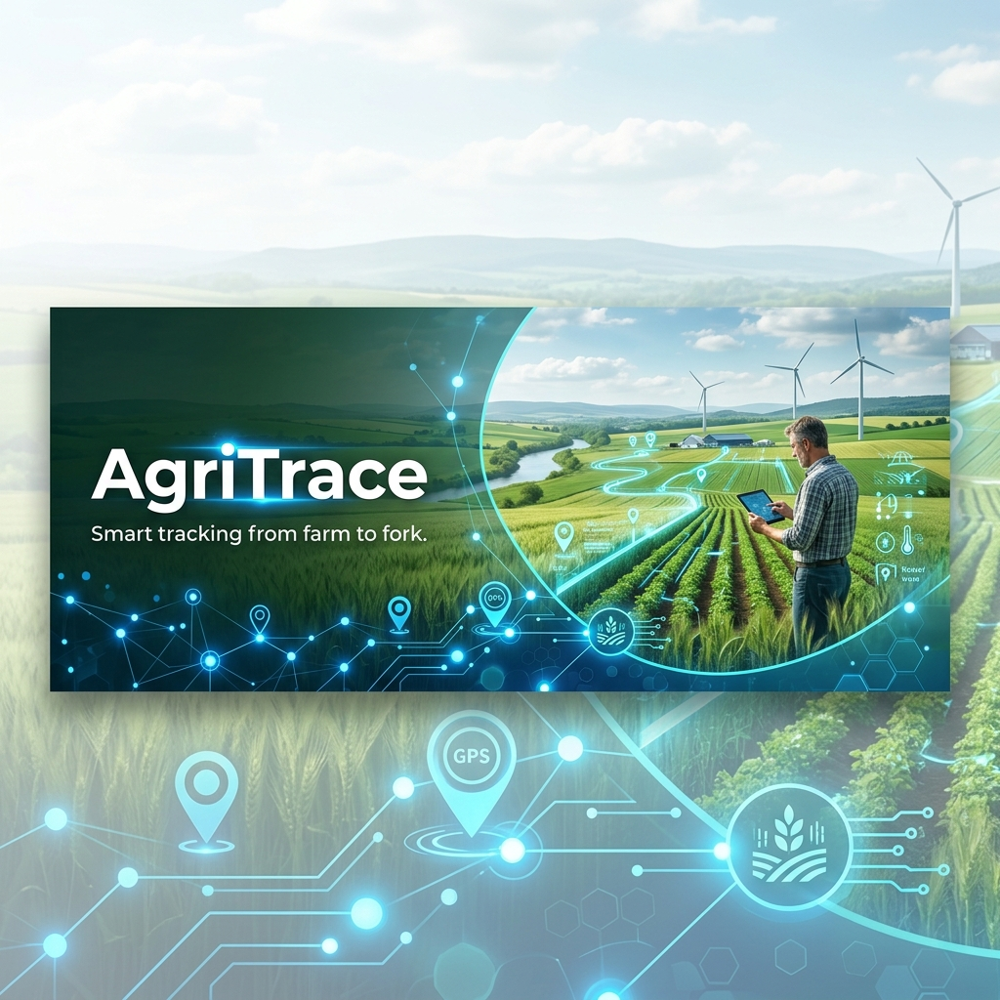

# 🌱 AgriTrace - Sustainable Agricultural Waste Management



A professional, full-stack platform designed to revolutionize agricultural waste tracking and recycling. AgriTrace connects farmers with recycling agents to reduce environmental impact and create a circular economy in agriculture.

[](https://agri-trace-virid.vercel.app)
[](https://opensource.org/licenses/MIT)
[](https://nextjs.org/)
[](https://www.typescriptlang.org/)

---

## 📋 Table of Contents

- [✨ Features](#-features)
- [🛠 Tech Stack](#-tech-stack)
- [🚀 Getting Started](#-getting-started)
- [📁 Project Structure](#-project-structure)
- [🔐 Security](#-security)
- [🚢 Deployment](#-deployment)
- [📝 Contributing](#-contributing)
- [📄 License](#-license)

---

## ✨ Features

### 🔑 Core Capabilities
- **Real-Time Tracking** - Monitor agricultural waste from reporting to recycling.
- **Role-Based Workflows** - Dedicated interfaces for **Farmers**, **Recycling Agents**, and **Administrators**.
- **Secure Payments** - Integrated **Razorpay** gateway for transparent transactions.
- **AI-Powered Insights** - Integrated with **Google GenAI** for waste classification and optimization.
- **Dynamic Dashboards** - Rich data visualization with Recharts for agents and admins.

### 🎨 Premium UI/UX
- **Modern Dark/Light Themes** - Built with Tailwind CSS and Framer Motion.
- **Responsive Layouts** - Seamless experience across mobile and desktop.
- **Accessible Components** - Leveraging Radix UI for high-quality interactions.

---

## 🛠 Tech Stack

| Category | Technology |
| :--- | :--- |
| **Frontend** | [Next.js 15.5](https://nextjs.org/), [React 18](https://reactjs.org/), [Tailwind CSS](https://tailwindcss.com/) |
| **Backend** | [Firebase Firestore](https://firebase.google.com/docs/firestore), [Firebase Auth](https://firebase.google.com/docs/auth) |
| **Payments** | [Razorpay](https://razorpay.com/) |
| **AI** | [Google GenKit](https://firebase.google.com/docs/genkit), [Google GenAI](https://ai.google.dev/) |
| **Icons & UI** | [Lucide React](https://lucide.dev/), [Radix UI](https://www.radix-ui.com/) |

---

## 🚀 Getting Started

### Prerequisites
- Node.js 18.17+
- Firebase Project
- Razorpay Account (API Keys)

### Quick Start
1. **Clone & Install**
   ```bash
   git clone https://github.com/harsh-pandhe/AgriTrace.git
   cd AgriTrace
   npm install
   ```

2. **Environment Setup**
   Copy `.env.local.example` to `.env.local` and fill in your credentials.

3. **Development Mode**
   ```bash
   npm run dev
   ```

---

## 📁 Project Structure

```bash
AgriTrace/
├── src/
│   ├── app/           # App Router & API routes
│   ├── components/    # Reusable UI & Dashboard components
│   ├── context/       # State management (Auth, Theme)
│   ├── hooks/         # Custom React hooks
│   └── lib/           # Services (Firebase, Razorpay)
├── docs/              # Reports, Research & Installation guides
├── public/            # Static assets (Banner, Favicon)
├── scripts/           # Automation & Data processing scripts
├── Project_Report/    # LaTeX Source for the project report
├── firebase.json      # Firebase configuration
└── package.json       # Metadata & Dependencies
```

---

## 🔐 Security

AgriTrace implements industry-standard security practices:
- **Role-Based Firestore Rules** - Strict validation for all database operations.
- **Environment Isolation** - Sensitive keys are never exposed on the client-side.
- **Input Validation** - Enforced by Zod schemas on both frontend and backend.

---

## 🚢 Deployment

The platform is optimized for Vercel and Firebase Hosting.
- Build command: `npm run build`
- Output: `.next`

Ready to deploy? [Live Link](https://agri-trace-virid.vercel.app)

---

## 📝 Contributing

Contributions are welcome! Please see [CONTRIBUTING.md](./CONTRIBUTING.md) for guidelines and our [CODE_OF_CONDUCT.md](./CODE_OF_CONDUCT.md).

---

## 📄 License

Distributed under the MIT License. See [LICENSE](./LICENSE) for more information.

---

## 🤝 Contact

**Harsh Pandhe** - [@harsh-pandhe](https://github.com/harsh-pandhe)

Project Link: [https://github.com/harsh-pandhe/AgriTrace](https://github.com/harsh-pandhe/AgriTrace)
